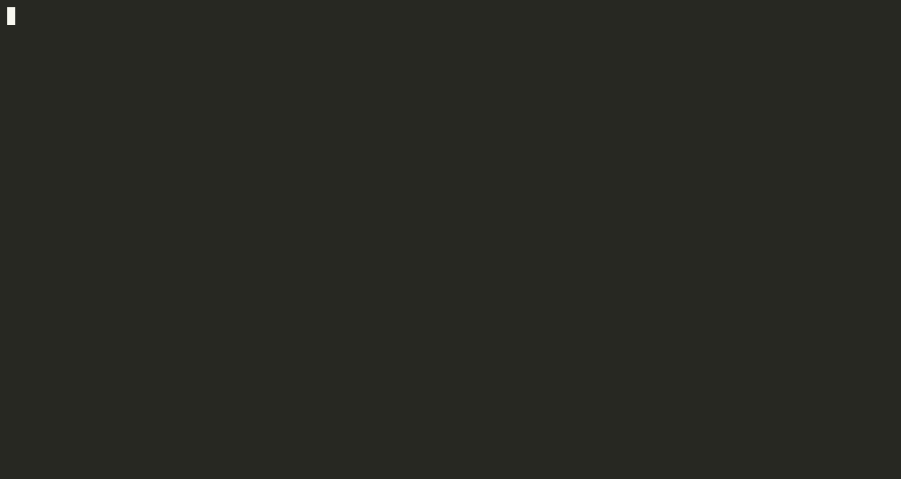

# ✨ cmdperf - Interactive Command Performance Benchmarking ✨

`cmdperf` is a terminal tool designed for developers who need to quickly **measure, compare, and understand the performance characteristics of shell commands**. Whether you're evaluating different implementations of a task (e.g., `grep` vs `rg`), checking the impact of command-line flags, or getting a feel for command latency under specific conditions (like concurrency or rate limits), `cmdperf` provides interactive feedback and clear, comparable results right in your terminal.



## Features

- Benchmark shell commands
- Support for parallel execution
- Compare commands
- Real-time terminal UI with live statistics, progress tracking and ETA
- Responsive
- Color schemes :)

## Non-Goals

- Precise analysis. We're deliberately spawning shells and such. cmdperf is a tool for quick and dirty benchmarking, not a scientific tool.
- Not a replacement for specialized benchmarking tools.

## Why Choose `cmdperf`?

While various tools exist, `cmdperf` offers a unique blend of features particularly useful for developers during analysis and comparison:

- **Interactive Real-time UI:** Unlike tools that only output results at the end, `cmdperf` provides a live-updating terminal interface showing progress, statistics (mean, min/max, stddev), and ETA. This visual feedback helps you understand performance *during* execution.
- **Direct Command Comparison:** Easily benchmark multiple commands head-to-head in a single invocation, with results clearly presented for comparison.
- **Concurrency Testing:** Run multiple instances of a command concurrently (`-c` flag) to understand performance under parallel load.
- **Rate Limiting:** Simulate specific throughput scenarios (`--rate` flag) to test how commands or the systems they interact with perform under controlled request rates.
- **Shell Flexibility:** Run commands via a specified shell (handling pipes, redirection, etc.) or execute them directly (`-N` flag) for simpler cases, avoiding shell overhead.
- **Multiple Output Formats:** Besides the TUI, results can be easily exported to Markdown (`--markdown`) or CSV (`--csv`) for documentation or further analysis.
- **Designed for Quick Insights:** While acknowledging it's not for rigorous scientific benchmarking (see Non-Goals), it's optimized for developers needing fast, actionable performance feedback.

`cmdperf` is ideal when you need more than basic timing but want an easier, more interactive experience than complex profiling suites, especially when comparing command variations or simulating specific load conditions.

## Installation

There are several ways to install `cmdperf`:

### Using `go install`

If you have a Go development environment set up, you can install the latest development version directly using `go install`:

```bash
go install github.com/miklosn/cmdperf/cmd/cmdperf@latest
```

Ensure your `GOPATH/bin` or `GOBIN` directory is included in your system's `PATH`.

### Using Homebrew (macOS/Linux)

On macOS or Linux, you can install `cmdperf` using Homebrew:

```bash
brew install miklosn/tap/cmdperf
```

### Using Pre-built Binaries

Pre-compiled binaries are available for Linux, macOS, and Windows on the [GitHub Releases page](https://github.com/miklosn/cmdperf/releases).

1. Download the appropriate archive for your operating system and architecture (e.g., `cmdperf_Linux_x86_64`, `cmdperf_Darwin_arm64`, `cmdperf_Windows_x86_64.exe`).
2. Extract the binary from the archive (if necessary).
3. (Linux/macOS) Make the binary executable: `chmod +x cmdperf_*`
4. Move the binary to a directory included in your system's `PATH`. Common locations include `/usr/local/bin` or `~/bin` on Linux/macOS. For Windows, you can place it in a directory and add that directory to your `PATH` environment variable.

### Using Package Managers (Linux)

`.deb` and `.rpm` packages are also provided on the [GitHub Releases page](https://github.com/miklosn/cmdperf/releases) for easier installation on compatible Linux distributions.

**Debian/Ubuntu:**

Download the `.deb` package and install it using `dpkg`:

```bash
sudo dpkg -i cmdperf_*.deb
```

If you encounter dependency issues, run:

```bash
sudo apt --fix-broken install
```

**Fedora/CentOS/RHEL:**

Download the `.rpm` package and install it using `rpm` or `dnf`:

```bash
# Using rpm
sudo rpm -i cmdperf_*.rpm

# Or using dnf
sudo dnf install cmdperf_*.rpm
```

## Usage

```bash
cmdperf [options] <command...>
```

For example:

```bash
# Basic usage
cmdperf "sleep 0.1"

# Multiple commands to compare
cmdperf "grep 'ERROR' mock.log" "rg 'ERROR' mock.log"

# Parallel execution with 10 concurrent processes
cmdperf -c 10 "curl -s https://example.com > /dev/null"

# Run 100 iterations of each command
cmdperf -n 100 "redis-cli PING"

# Run benchmark for 30 seconds
cmdperf -d 30s "redis-cli PING"

# Output results to a Markdown file
cmdperf --markdown results.md "sleep 0.1" "sleep 0.2"

# Output results to a CSV file
cmdperf --csv results.csv "sleep 0.1" "sleep 0.2"
```

## CLI Options

```
Arguments:
  <command...>    Command(s) to benchmark

Options:
  -n, --runs=<n>                Number of runs to perform [default: 10]
  -c, --concurrency=<n>         Number of concurrent executions [default: 1]
      --color-scheme=<scheme>   Color scheme to use (auto, catppuccin, tokyonight, nord, monokai, solarized, solarized-light, gruvbox, monochrome) [default: auto]
      --list-color-schemes      List available color schemes
  -t, --timeout=<duration>      Timeout for each command execution [default: 1m]
  -d, --duration=<duration>     Total benchmark duration (overrides --runs)
  -r, --rate=<rate>            Target rate limit (requests per second)
  -s, --shell=<shell>           Shell to use for command execution [default: /bin/sh]
      --shell-opt=<opt>         Shell option (can be repeated) [default: -c]
  -N, --no-shell                Execute commands directly without a shell
      --csv=<file>              Write results to CSV file
      --markdown=<file>         Write results to Markdown file
      --version                 Show version information
      --fail-on-error           Exit with non-zero status if any command returns non-zero exit code
      --cpu-profile=<file>      Write CPU profile to file
      --mem-profile=<file>      Write memory profile to file
      --block-profile=<file>    Write goroutine blocking profile to file
      --pprof-server            Start pprof HTTP server on :6060
```

## Color Schemes

cmdperf supports various color schemes to match your terminal theme:

```bash
# Use a specific color scheme
cmdperf --color-scheme=nord "sleep 0.1"

# Automatically detect terminal background and choose appropriate theme
cmdperf --color-scheme=auto "sleep 0.1"

# List available color schemes
cmdperf --list-color-schemes
```

Available color schemes include:

- default: Default color scheme
- auto: Automatically selects a theme based on terminal background
- catppuccin: Soothing pastel theme (Mocha variant)
- tokyonight: A dark and elegant theme
- nord: Arctic, north-bluish color palette
- monokai: Vibrant and colorful theme
- solarized: Precision colors for machines and people (dark variant)
- solarized-light: Precision colors for machines and people (light variant)
- monochrome: Simple black and white theme (no colors)

## Direct Execution Mode

By default, cmdperf executes commands through a shell (usually `/bin/sh -c`). This allows for shell features like pipes, redirections, and variable expansions. However, for simple commands, you can use direct execution mode to bypass the shell:

```bash
cmdperf -N "ls -la"
```

In direct execution mode:

- The command is split by spaces (respecting quotes)
- The first part is used as the executable
- The remaining parts are passed as arguments
- Shell features like pipes (`|`), redirections (`>`), and variable expansions (`$VAR`) won't work
- The command is executed directly without a shell

Please note that even without spawning a shell, `cmdperf` is not designed for high frequency benchmarking.

## Output

cmdperf provides a colorful, real-time UI that shows:

- Command execution progress
- Mean execution time with standard deviation
- Min/max execution time range
- Estimated time to completion
- Comparison between commands (when benchmarking multiple commands)

## CSV Output

You can export benchmark results to a CSV file for further analysis:

```bash
cmdperf --csv=results.csv "sleep 0.1" "sleep 0.2"
```

The CSV output includes detailed metrics for each command:

- Command string
- Total runs and successful runs
- Error counts and non-zero exit codes
- Timing statistics (min, max, mean, median, standard deviation)
- Throughput and target rate (if rate limiting was used)

## Markdown Output

You can export benchmark results to a Markdown file for documentation or sharing:

```bash
cmdperf --markdown=results.md "sleep 0.1" "sleep 0.2"
```

## Rate Limiting

You can limit the rate at which commands are executed using the `--rate` option:

```bash
# Limit execution to 10 requests per second
cmdperf --rate=10 "redis-cli GET mykey"
```

This is useful for:

- Simulating specific load patterns
- Preventing overloading of the target system
- Testing how services perform under controlled request rates

The actual achieved rate will be reported in the results, allowing you to compare the target rate with what was actually achieved.

## Community & Support

Found `cmdperf` useful? Here's how you can get involved or get help:

- **⭐ Star the Project:** Show your support by starring the [cmdperf repository](https://github.com/miklosn/cmdperf) on GitHub!
- **🐞 Report Issues:** Encounter a bug or have a suggestion? Please open an issue on the [GitHub Issues page](https://github.com/miklosn/cmdperf/issues).
- **🤝 Contribute:** We welcome contributions! Please see our [Contributing Guidelines](CONTRIBUTING.md) for details on how to submit pull requests, report bugs, or suggest features.

## License

MIT
